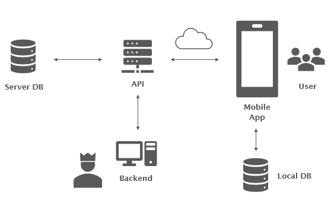

# Entsorgungs-App of Entsorgung & Recycling Stadt Bern

The app Entsorgung Bern is a service for the citizens and businesses of the city of Bern. In addition to an overview of all the city's waste disposal services and their locations, the tool provides information about the collection dates for refuse, paper/cardboard and green waste. By means of favourites, users can save their collection dates and the service times of the ÖkoInfoMobil and be reminded of them via personalised push notifications. If push notifications are activated as a matter of principle, you will receive acute information, e.g. in the event of extraordinary closures of the waste disposal centres or collection cancellations. A comprehensive ABC of waste disposal rounds off the tool.

The app offers the following functions:

- Street directory with collection data for the paper/cardboard, refuse and green waste fractions
- Reminder services for collection by fraction
- ÖkoInfoMobil timetable and push reminders
- ABC collection point with information on the fractions at the collection points
- Information on the disposal yards
- ABC of waste disposal: What can I dispose of where and at what rate?
- Information on other municipal waste disposal services

The app was developed as part of a thesis in the field of information technology at the Bern University of Applied Sciences. It is constantly being professionally developed. Ideas and feedback on the app are welcome.
In addition to the current functionalities, an extension with a map view of the collection points is planned.

## Getting Started

This repository contains the mobile app in the folder erb-mobile-app and the apps used for the backend in the folder erb-backend. In each folder you can find a readme-file which describes the application and the steps needed to build the applications.

- [erb-mobile-app](erb-mobile-app/README.md)
- [erb-backend](erb-backend/README.md)
  - db-api-express
  - hybrid-app-erb-server

## Installation

The information on installation and operation for the components of this project you can find in the readme-files:

- [erb-mobile-app](erb-mobile-app/README.md)
- [erb-backend](erb-backend/README.md)

## Contributing

The Guidelines for contributing are defined in the [Community Management Entsorgungs-App](Community_Management_Entsorgungs-App.pdf)

## Authors

The app was developed as part of a thesis in the field of information technology at the Bern University of Applied Sciences.

Now the application is operated and maintained by [ACE digital solutions](https://www.ace-digital-solutions.ch/).

## Contact

kommunikation.erb@bern.ch

## License

This project is licensed under the GNU Affero General Public License - see the [LICENSE](LICENSE) file for details.
